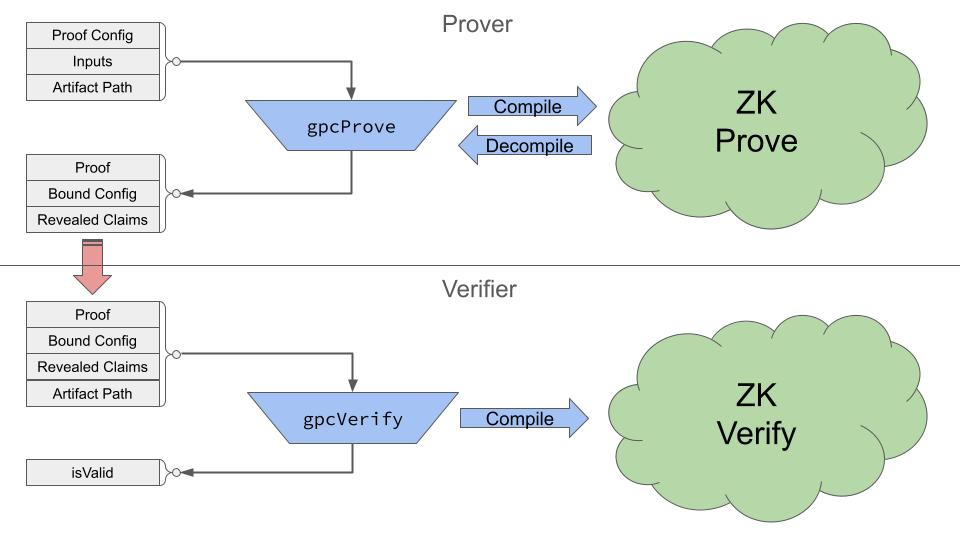

This page describes the details of what happens when a prover generates a GPC proof, and what happens when a verifier checks that proof.

## Overall Flow

The GPC library allows your app to describe a proof using a human-readable [configuration](./proof-configuration).  This configuration defines what you want to prove, by putting constraints on some given PODs.

GPC is named for the **General Purpose Circuits** used to make proofs. These are modular, configurable [ZK circuits](https://docs.circom.io/background/background/) of different sizes grouped into a family. To prove a configuration, the GPC library will pick the smallest (and therefore fastest) circuit with sufficient modules for your configuration, and then fetch the binary files (called [artifacts](./artifacts)) needed to use it.

Your app doesn't need to interact directly with circuits because the **GPC compiler** translates between the application layer and the cryptographic layer of ZK circuits. When a prover calls [gpcProve()](#proof-phases) the compiler translates your configuration into the numeric inputs to a circuit.  It then reverses the process to translate the output of the circuit into the revealed claims.

When a verifier calls [gpcVerify()](#verification-phases), a similar compilation process happens. Repeating compilation confirms that the configuration and claims match the inputs to the circuit when it is verified. Verification returns a simple boolean result, so no decompilation is necessary.



The sections below provide more details on the parts of this process shown in the diagram above.

## Inputs and Outputs

To generate a proof, call the [gpcProve()](https://docs.pcd.team/functions/_pcd_gpc.gpcProve.html) function. To do so you'll need to set up these arguments:

- [Proof Configuration](https://docs.pcd.team/types/_pcd_gpc.GPCProofConfig.html) is the description of what you want to prove.  In many cases, the same configuration can be reused to generate many proofs. The configuration defines constraints which inputs must satisfy. See the [configuration](./proof-configuration) page for more information on the available constraints.
- [Inputs](https://docs.pcd.team/types/_pcd_gpc.GPCProofInputs.html) are the input data constrained by the configuration. Inputs are more likely to be different for each proof you generate.  Primarily these are the PODs you want to prove about.  Inputs also include other public information such as membership lists, and private values such the identity of a POD's [owner](./identity-ownership).
- [Artifacts Path](./artifacts) is a URL or filesystem path where the binary files for the circuit family can be found. Prover and verifier must use the same version of artifacts to maintain compatibility. The artifacts needed for proving are somewhat large (10s of MB) while those for verification are smaller (10s of KB).  See the [artifacts](./artifacts) page for more details.
- [Circuit Family](https://docs.pcd.team/types/_pcd_gpc.GPCCircuitFamily.html) [optional] is the list of available circuits with their defining parameters. You can pass this optional argument if you want to override the default family to use custom-generated circuits, or pick from a smaller subset.

```ts
 const { proof, boundConfig, revealedClaims } = await gpcProve(
   proofConfig,
   proofInputs,
   GPC_ARTIFACTS_PATH
 );
```

[gpcProve()](https://docs.pcd.team/functions/_pcd_gpc.gpcProve.html) will throw an error if your inputs are malformed or don't satisfy the configured constraints. Otherwise it will produce these outputs:

- [Proof](https://docs.pcd.team/types/_pcd_gpc.GPCProof.html) is the mathematical proof of your claims.  This JSON object contains opaque numbers you shouldn't need to manipulate directly.
- [Bound Configuration](https://docs.pcd.team/types/_pcd_gpc.GPCBoundConfig.html) is the same as the original proof configuration, with the addition of a circuit identifier specifying the specific circuit which was chosen.  The bound config is also in a canonical form.  Optional fields are simplified so that equivalent configurations are more likely to look identical.
- [Revealed Claims](https://docs.pcd.team/types/_pcd_gpc.GPCRevealedClaims.html) contains the parts of the proof inputs which are publicly revealed in the proof, such as POD entries, membership lists, or [nullifiers](./identity-ownership).

These three outputs are precisely what the prover needs to send to the verifier.  With these 3 arguments, plus an artifacts path and optional circuit family, you can call [gpcVerify()](https://docs.pcd.team/functions/_pcd_gpc.gpcVerify.html).

```ts
 const isValid = await gpcVerify(
   proof,
   boundConfig,
   revealedClaims,
   GPC_ARTIFACTS_PATH
 );
```

Verification will throw an error if the inputs are malformed, or else return a boolean indicating whether the proof is valid. If it returns true, there are app-specific checks to perform next, as described on the [verification](./verification) page.

## Proof Phases

Inside of [gpcProve()](https://docs.pcd.team/functions/_pcd_gpc.gpcProve.html) the proving process goes through several phases:

1. **Check**: Validate all arguments and throw an error if any of them are malformed or contain illegal values. This checks structure and valid ranges, but doesn't do cryptographic validation.
2. **Requirements**: Determine the number of modules and size parameters required for the configured proof  Then ick the smallest circuit which can fit. Or else if the config contains a specific circuit identifier, ensure that specific circuit can fit.
3. **Bind**: Canonicalize the configuration and add the selected circuit identifier to generate the Bound Configuration.
4. **Compile**: Translate the configuration into the inputs for the selected circuit.
5. **Load Artifacts**: Form a URL or file path to the specific artifacts (proving key, witness generator) needed, then load them.  This is a fetch from a URL if in browser, or a read from disk otherwise.
6. **Generate Proof**: The cryptographic process of proof generation uses the witness generator and proving key to process the inputs and produce outputs.
7. **Decompile**: Use the circuit outputs plus the original inputs to form the revealed claims.

There are also other functions in the library which allow you to perform some of these steps separately for specific needs.  This can allow you to customize or relocate the proving itself without duplicating the work of the GPC compiler.

For instance [gpcCheckProvable()](https://docs.pcd.team/functions/_pcd_gpc.gpcCheckProvable.html) lets you check if a given set of inputs fit your configured constraints without the expensive cryptography.  If you want to customize the ZK proving step or perform it using a native library, you can call [gpcPreProve()](https://docs.pcd.team/functions/_pcd_gpc.gpcPreProve.html) to perform steps 1-4, then use your own prover before calling [gpcPostProve()](https://docs.pcd.team/functions/_pcd_gpc.gpcPostProve.html) to decompile the results.

## Verification Phases

Inside of [gpcVerify()](https://docs.pcd.team/functions/_pcd_gpc.gpcVerify.html) the verification process goes through phases quite similar to proving:

1. **Check**: Validate all arguments and throw an error if any of them are malformed or contain illegal values. This checks structure and valid ranges, but doesn't do cryptographic validation.
2. **Requirements**: Determine the number of modules and size parameters required for the configured proof.  Find the circuit identified in the Bound Configuration and ensure it fits the requirements.
4. **Compile**: Translate the configuration and claims into the public signals for the selected circuit.
5. **Load Artifacts**: Form a URL or file path to the specific artifact (verification key) needed, then load it. This is a fetch from a URL if in browser, or a read from disk otherwise.
6. **Verify Proof**: The cryptographic process of proof verification uses verification key to process the public signals and determine whether the proof is cryptographically valid.

If you want to customize the verification process, you can call [gpcPreVerify()](https://docs.pcd.team/functions/_pcd_gpc.gpcPreVerify.html) to perform steps 1-4 without proof verification. This allows you to reuse the GPC compiler with your own verification stack, perhaps in preparation for [on-chain verification](./on-chain).
